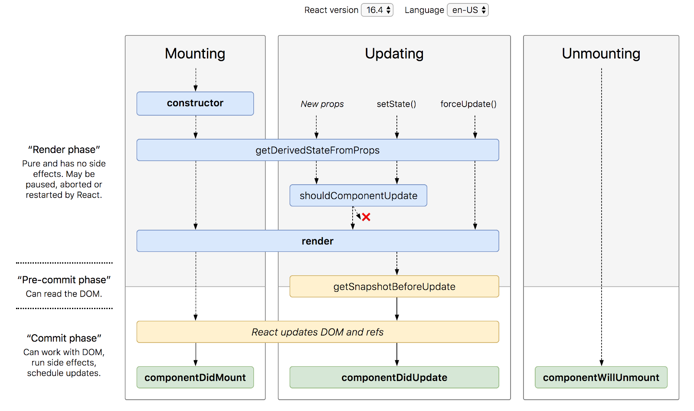

# React의 Lifecycle


위 그림은 리액트 버전 16.3의 lifecycle이고 아래 그림은 16.4의 lifecycle이다



### constructor

```react
constructor(props) {
  super(props);
}
```

컴포넌트 생성자 함수로써 컴포넌트가 새로 만들어질 때마다 이 함수가 호출된다.

### componentDidMount

```react
componentDidMount() {
  // 외부 라이브러리 연동: D3, masonry, etc
  // 컴포넌트에서 필요한 데이터 요청: Ajax, GraphQL, etc
  // DOM 에 관련된 작업: 스크롤 설정, 크기 읽어오기 등
}
```

이 API 는 여러분의 컴포넌트가 화면에 나타나게 됐을 때 호출된다.

여기선 주로 D3, masonry 처럼 DOM 을 사용해야하는 외부 라이브러리 연동을 하거나, 해당 컴포넌트에서 필요로하는 데이터를 요청하기 위해 axios, fetch 등을 통하여 ajax 요청을 하거나, DOM 의 속성을 읽거나 직접 변경하는 작업을 진행한다.

## 컴포넌트 업데이트

### static getDerivedStateFromProps()

```react
static getDerivedStateFromProps(nextProps, prevState) {
  // 여기서는 setState 를 하는 것이 아니라
  // 특정 props 가 바뀔 때 설정하고 설정하고 싶은 state 값을 리턴하는 형태로
  // 사용됩니다.
  /*
  if (nextProps.value !== prevState.value) {
    return { value: nextProps.value };
  }
  return null; // null 을 리턴하면 따로 업데이트 할 것은 없다라는 의미
  */
}
```

### shouldComponentUpdate

```react
shouldComponentUpdate(nextProps, nextState) {
  // return false 하면 업데이트를 안함
  // return this.props.checked !== nextProps.checked
  return true;
}
```

이 API 는 컴포넌트를 최적화하는 작업에서 매우 유용하게 사용된다. 변화가 발생한 부분만 감지해내기 위해서는 Virtual DOM 에 한번 그려줘야한다.

즉, 현재 컴포넌트의 상태가 업데이트되지 않아도, 부모 컴포넌트가 리렌더링되면, 자식 컴포넌트들도 렌더링 됩니다. 여기서 "렌더링" 된다는건, render() 함수가 호출된다는 의미다.

낭비되고 있는 이 CPU 처리량을 줄여주기 위해서 우리는 Virtual DOM 에 리렌더링 하는것도,불필요할경우엔 방지하기 위해서 shouldComponentUpdate 를 작성합니다.

이 함수는 기본적으로 true 를 반환합니다. 우리가 따로 작성을 해주어서 조건에 따라 false 를 반환하면 해당 조건에는 render 함수를 호출하지 않는다.

### getSnapshotBeforeUpdate()

이 API 가 발생하는 시점은 다음과 같다.

1. render()
2. **getSnapshotBeforeUpdate()**
3. 실제 DOM 에 변화 발생
4. componentDidUpdate

이 API를 통해서, DOM 변화가 일어나기 직전의 DOM 상태를 가져오고, 여기서 리턴하는 값은 componentDidUpdate 에서 3번째 파라미터로 받아올 수 있게 된다.

### componentDidUpdate

```react
componentDidUpdate(prevProps, prevState, snapshot) {

}
```

이 API는 컴포넌트에서 render() 를 호출하고난 다음에 발생하게 됩니다. 이 시점에선 this.props 와 this.state 가 바뀌어있다. 그리고 파라미터를 통해 이전의 값인 prevProps 와 prevState 를 조회 할 수 있습니다. 그리고, getSnapshotBeforeUpdate 에서 반환한 snapshot 값은 세번째 값으로 받아옵니다.

### 컴포넌트 제거

### componentWillUnmount

```react
componentWillUnmount() {
  // 이벤트, setTimeout, 외부 라이브러리 인스턴스 제거
}
```

여기서는 주로 등록했었던 이벤트를 제거하고, 만약에 setTimeout 을 걸은것이 있다면 clearTimeout 을 통하여 제거를 한다. 추가적으로, 외부 라이브러리를 사용한게 있고 해당 라이브러리에 dispose 기능이 있다면 여기서 호출해주면 된다.